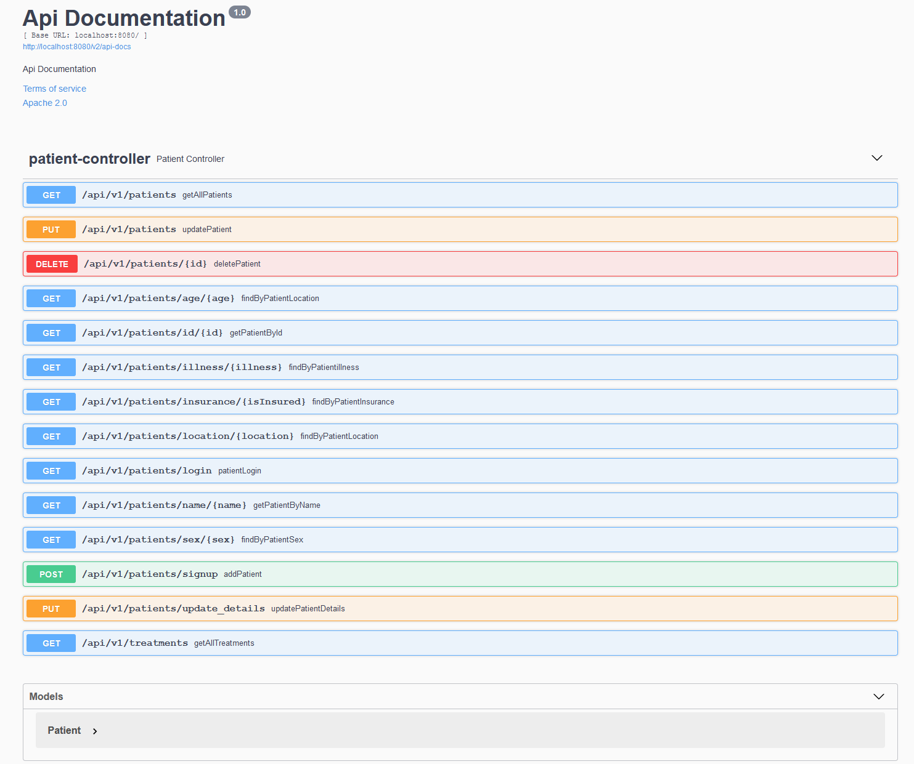
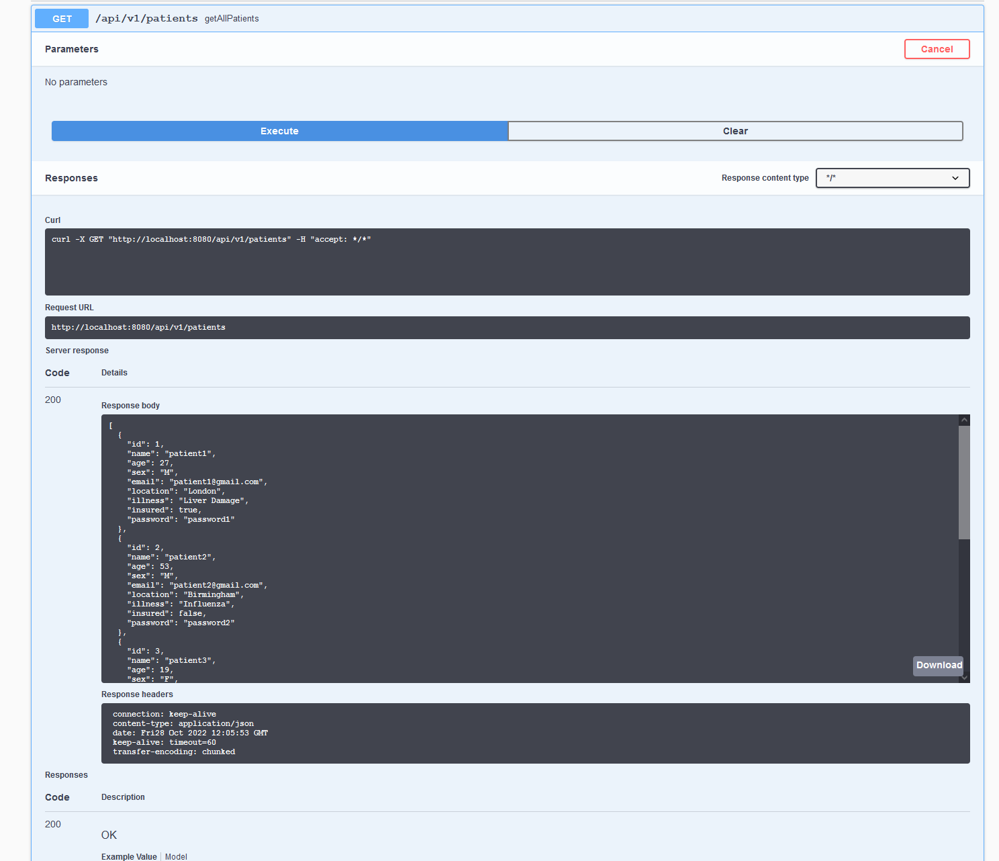
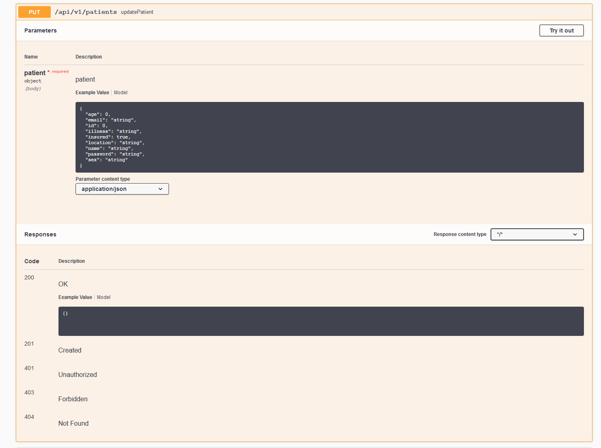
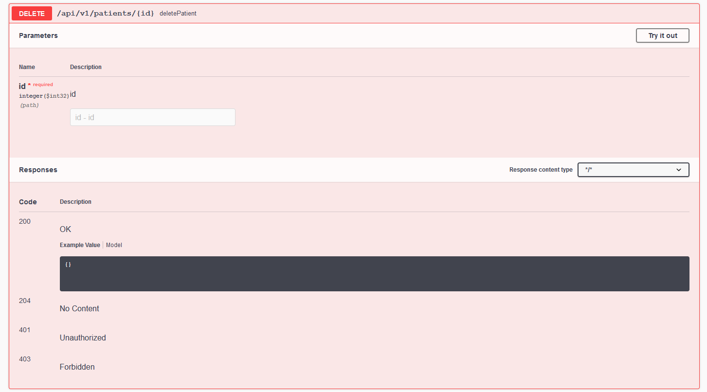
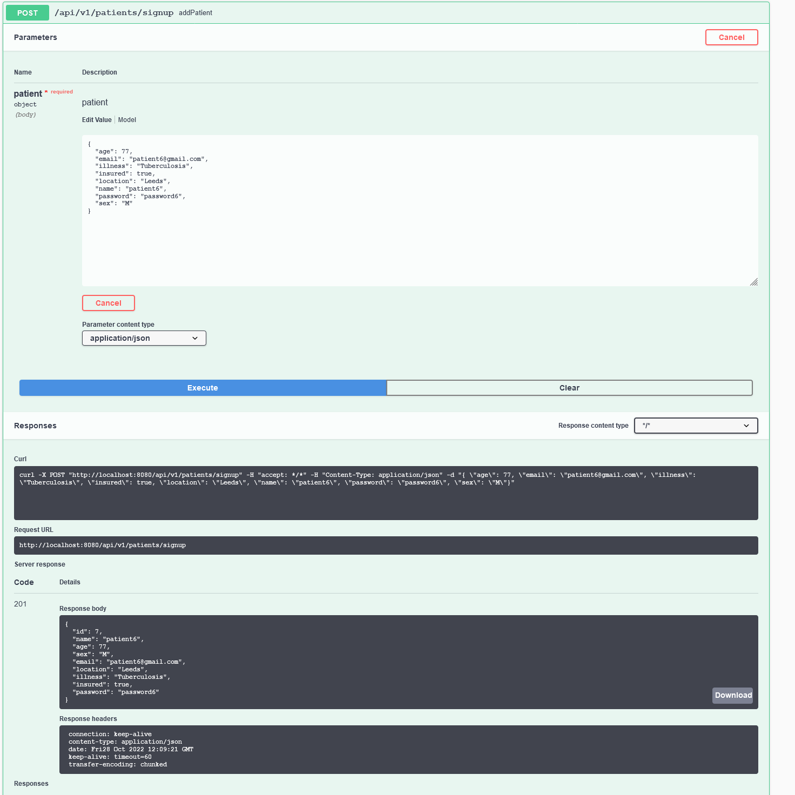

# patient-information-system

The objective of this project is to provide an accessible database system for storing information on entities known as patients. The user should be able to add new patients, remove patients, update the details of a particular patient, access a list of all the patients, and access a group of or individual patients based on user input criteria.

### Problem Statement
- Project should have the proper structure (controller/service/repository/entity layers used appropriately)
- Proper usage of git VCS (branching, frequent and descriptive commits)
- Implementation of signup and login methods
- Test units for repository/service/controller layers
- Documented endpoints using Swagger


### Tech Stack
This application is built using the following tech stack:
- JDK 19
- MySQL 8.0.13
- SpringBoot 2.7.5
- Maven 3.4

### Steps to Run Locally
1. Add a new patient to the database ( a sample patient illustrating the required data fields will be provided below )
2. Call the list of patients from `http://localhost:8080/api/v1/patients`
3. Login with id, email and password to retrieve associated patient data

# End Points
List of all Patients:

```bash
http://localhost:8080/api/v1/patients
```

Add Patient:

```bash
http://localhost:8080/api/v1/signup
```

Login:

```bash
http://localhost:8080/api/v1/login
```
### Overview


### Get All Patients


### Update Patient


### Delete Patient


### Sign Up


### Log In
